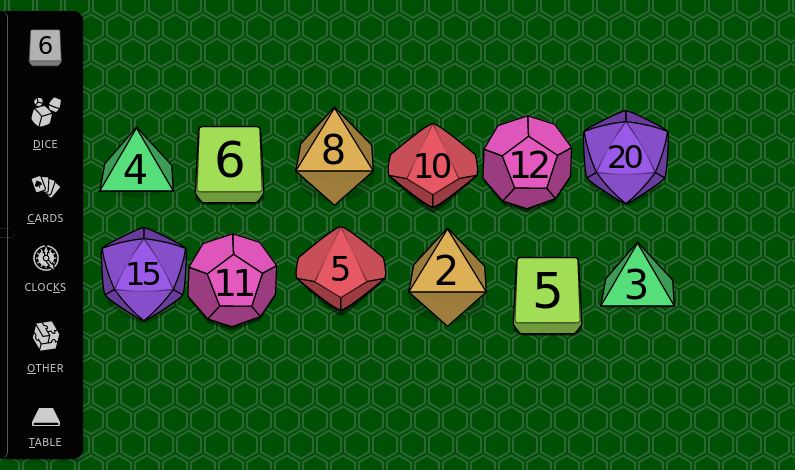

# Togetherness Table

[](https://circleci.com/gh/sjbrown/togetherness)

Tabletop RPGs are no longer just played in physical spaces. More and more,
this kind of game is being played online, and players are
discovering online dice rollers, communal game maps, virtual tabletops,
and digital character keepers. But too often these tools are walled
gardens whose owners see players as *products*, not human beings.



Togetherness is a web-based virtual tabletop whose chief aim is
the empowerment of players as free human beings participating voluntarily
in a community. There are no "owners", just equal participants enjoying a
gamut of activities including "creation", "play" and "hosting".

## History

After joining The Gauntlet and playing around with the awesome
[roller](https://github.com/shanel/roller),
I got the itch to create my own "dice-rolling" application.

## Goals

Here are some goals for Togetherness:

 * Document-centric.  The state should all live in the document.
 * Use HTML5. Use SVG.
   * Don't reinvent wheels that already exist
   * Use the opportunity to deeply learn the standards
 * No server
   * No software to install
   * Easy for new developers to contribute / fork
 * Use [TogetherJS](https://togetherjs.com/)
   * Don't reinvent wheels
   * Meets above goals
   * Batteries included!
     * real time content sync
     * user focus
     * user presence
     * text chat

# Live Demo

I'm going to try to keep a demo up and running at
[https://www.1kfa.com/table](https://www.1kfa.com/table)

# Quick Start

```bash
cd /tmp
git clone <this repo>
cd togetherness/src
python2 -m SimpleHTTPServer 8000
# Or,if you prefer Python3 to Python2:
# python3 -m http.server
# Or if you prefer Node.js to Python:
# npm install npx -g; npx http-server -a localhost -p 8000
```

Then open your browser to [localhost:8000](http://localhost:8000/)

That's it!

# Making your own "objects" for the table

Any interactive objects (dice, decks of cards, etc) are simply SVG files.

Click on `+ Other` and then `+ SVG File` and you can paste in an SVG
file.  Ensure the "Allow JavaScript" option is selected.

## Interactivity Interface

To make your object interactive, you need to include some JavaScript.

Your `<script>` element needs to have an attribute `data-namespace`
with a name that's unique to your object.

Inside the script, there must be one JavaScript object whose name
matches that `data-namespace` value. This object uses a specially-named
key, "menu", to integrate with the main web UI:


```xml
<svg x="0" y="0" width="100" height="100">
  <rect x="25" y="25" width="50" height="50" style="fill:#ff0000" />
  <script
    type="text/javascript"
    data-namespace="myThing"
  ><![CDATA[

myThing = {

  menu: {
    'Change Color': {
      eventName: 'changeMyColor',
      applicable: (elem) => { return true },
      uiLabel: (elem) => { return 'Change Color To Green' },
      handler: function(evt) {
        // Note - "handler" must be written as a traditional function,
        // not an arrow-function, so that "this" is bound correctly
        console.log('Changing color!')
        this.querySelector('rect').style['fill'] = '#00ff00'
      },
    },
  },

}

]]></script>
</svg>
```

That's it!

## Developers: Permanently adding objects

If you've forked this repo and want to make your interactive objects
permanent, you can do the following:

First, add a `+ My Thing` button to the `index.html` file.

```
<button class="btn" onclick="add_object('svg/v1/my_thing.svg')">
 + My Thing
</button>
```

Then just add the file `svg/v1/my_thing.svg`.

